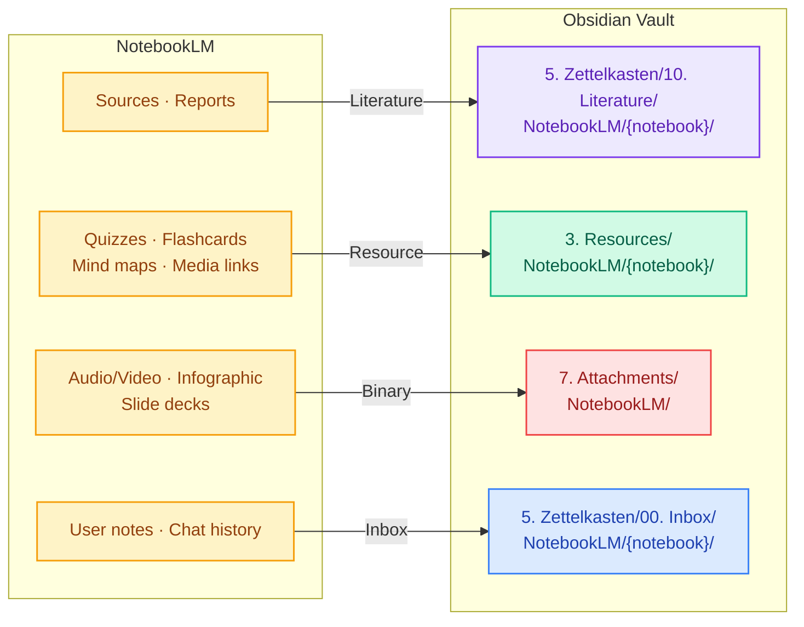

<div align="center">

# nlm2obsidian

**Import your Google NotebookLM notebooks into Obsidian**

[](https://python.org)
[](LICENSE)
[](https://obsidian.md)

*Sources, reports, quizzes, flashcards, mind maps, audio, video, notes, and chat history — all in one command.*

[**English**](README.md) | [Korean (한국어)](README.ko.md)

</div>

---

## What It Does

`nlm2obsidian` is a CLI tool that pulls everything from your NotebookLM notebooks and organizes it into your Obsidian vault using **Zettelkasten + PARA** conventions.



### Key Features

- **All content types** — sources, reports, quizzes, flashcards, mind maps, audio, video, infographics, slide decks, user notes, chat history
- **Obsidian-native output** — proper YAML frontmatter, tags, and `![[wikilinks]]` for attachments
- **Duplicate prevention** — tracks what's been imported via a sync state file; re-runs skip already-imported items
- **Selective import** — filter by notebook name (partial match) and content type
- **Dry-run mode** — preview what would be imported without writing any files
- **Graceful error handling** — if one item fails, the rest keep going; failures are summarized at the end

---

## Quick Start

### Prerequisites

- Python 3.9+
- [notebooklm-py](https://pypi.org/project/notebooklm-py/) (installed automatically)
- An Obsidian vault with Zettelkasten/PARA folder structure

### Install

```bash
cd nlm2obsidian
pip install .
```

### Authenticate

```bash
nlm2obsidian login
```

This opens a browser for Google authentication. Your session is stored locally by `notebooklm-py`.

### Import

```bash
# See what you have
nlm2obsidian list

# Preview an import (no files written)
nlm2obsidian import --notebook "AI Research" --dry-run

# Import everything from one notebook
nlm2obsidian import --notebook "AI Research"

# Import only sources from all notebooks
nlm2obsidian import --notebook "all" --type sources
```

---

## Commands

### `nlm2obsidian login`

Authenticate with your Google account for NotebookLM access.

### `nlm2obsidian list`

Display all notebooks with source counts.

```
Title                                   Sources  ID
────────────────────────────────────────────────────────
AI Research                                  12  abc123...
Reading Notes                                 5  def456...

Total: 2 notebook(s)
```

### `nlm2obsidian import`

The main command. Fetches content from NotebookLM and writes Obsidian-compatible markdown to your vault.

| Option | Default | Description |
|--------|---------|-------------|
| `--vault PATH` | `~/Obsidian` | Path to your Obsidian vault root |
| `--notebook NAME` | *(required)* | Notebook name (partial match, case-insensitive) or `"all"` |
| `--type TYPE` | `all` | `all`, `sources`, `artifacts`, or `notes` |
| `--include-media` | off | Download audio/video binary files |
| `--dry-run` | off | Preview only — no files written, no state changed |
| `--force` | off | Re-import items that were already synced |
| `-v, --verbose` | off | Show detailed progress for each item |

**Examples:**

```bash
# Import a specific notebook (partial name match)
nlm2obsidian import --notebook "논문"

# Import with audio/video downloads
nlm2obsidian import --notebook "Podcast Notes" --include-media

# Force re-import everything
nlm2obsidian import --notebook "all" --force -v
```

### `nlm2obsidian status`

Show what has been synced.

```
Notebook                             Sources  Artifacts  Notes  Chat   Last Sync
──────────────────────────────────────────────────────────────────────────────────
AI Research                               12          3      2   Yes   2026-03-17T10:30:00
Reading Notes                              5          1      0    No   2026-03-17T10:28:00
```

---

## Content Mapping

Each NotebookLM content type is routed to the appropriate Obsidian folder and note format:

| Content Type | Vault Path | Note Type | Frontmatter |
|:---|:---|:---:|:---|
| Source (AI summary) | `5. Zettelkasten/10. Literature/` | Literature | `type`, `status`, `created`, `updated`, `source`, `author` |
| Report | `5. Zettelkasten/10. Literature/` | Literature | same as above |
| Quiz | `3. Resources/` | Resource | `type`, `status` only |
| Flashcard | `3. Resources/` | Resource | `type`, `status` only |
| Mind map | `3. Resources/` + `7. Attachments/` | Resource | `type`, `status` only |
| Audio / Video | `3. Resources/` + `7. Attachments/` | Resource | `type`, `status` only |
| Infographic | `3. Resources/` + `7. Attachments/` | Resource | `type`, `status` only |
| Slide deck | `3. Resources/` + `7. Attachments/` | Resource | `type`, `status` only |
| User note | `5. Zettelkasten/00. Inbox/` | Inbox | `type`, `status`, `created`, `updated`, `source` |
| Chat history | `5. Zettelkasten/00. Inbox/` | Inbox | same as above |

> **Why different frontmatter?**
> Literature and Inbox notes live in the Zettelkasten folder, which tracks knowledge evolution with explicit dates. Resource notes live in the PARA `3. Resources/` folder, where Obsidian's OS metadata is used instead — no `created`/`updated` fields.

---

## How Sync Works

State is tracked in `.notebooklm-sync.json` at your vault root:

```
Obsidian/
├── .notebooklm-sync.json    <-- tracks what's been imported
├── 3. Resources/
│   └── NotebookLM/
│       └── AI Research/
│           ├── Quiz - Chapter 1.md
│           └── Flashcards - Key Terms.md
├── 5. Zettelkasten/
│   ├── 00. Inbox/
│   │   └── NotebookLM/
│   │       └── AI Research/
│   │           ├── My Notes.md
│   │           └── Chat History.md
│   └── 10. Literature/
│       └── NotebookLM/
│           └── AI Research/
│               ├── Attention Is All You Need.md
│               └── Study Guide.md
└── 7. Attachments/
    └── NotebookLM/
        └── AI Research/
            ├── Overview.mp4
            └── Mind Map.json
```

- **First run**: imports everything, creates the sync file
- **Subsequent runs**: skips already-imported items (checked by API ID, not filename)
- **`--force`**: re-imports everything, overwriting existing files
- **No deletions**: the tool never removes files from your vault

---

## Known Limitations

| Limitation | Details |
|---|---|
| **Source content is AI summary only** | The NotebookLM API does not expose full source text. Sources are imported as AI-generated summaries via `get_guide()`. The `author` field is set to "NotebookLM AI Summary" to make this clear. |
| **Report/Quiz/Flashcard parsing is best-effort** | These content types are extracted from undocumented API structures. If extraction fails, a placeholder note is created with a message to check the NotebookLM web UI. |
| **One-way import only** | Changes in Obsidian are never pushed back to NotebookLM. |
| **Single user** | Designed for one vault, one NotebookLM account. |
| **No scheduled sync** | Run manually when you want to import. No daemon or cron. |

---

## Architecture

```
cli.py              Click CLI — parses args, wraps asyncio.run()
    │
    ▼
importer.py         Orchestrates per-notebook import, routes by content type
    │
    ├──▶ formatters.py     Pure functions: markdown generation, frontmatter, tags
    ├──▶ raw_parser.py     Extracts report/quiz/flashcard text from raw API data
    └──▶ sync_state.py     JSON-based duplicate tracking at vault root
```

---

## License

MIT
